# 1. Abstract

Generative diffusion models now synthesise images that the human eye cannot
reliably tell apart from real photographs. This project, **VeriVision**, builds
an interpretable deep-learning system that classifies an image as either
**REAL** (camera-captured) or **FAKE** (AI-generated), and explains every
decision with a visual saliency map.

The detector is trained on the **CIFAKE** dataset (120,000 images) and is built
around two models: a convolutional neural network written from scratch and a
ResNet-50 transfer-learning model. A distinctive preprocessing contribution
adds the **Fourier-magnitude spectrum** of each image as an extra input
channel, exploiting the spectral fingerprints that diffusion models leave
behind. On the held-out 20,000-image test set the from-scratch CNN reaches
**96.8 % accuracy** and the ResNet-50 model reaches **98.3 % accuracy** with a
ROC-AUC of **0.998**.

Around this detector, the project is deliberately extended into a
**whole-syllabus computer-vision portfolio**. A classical-CV toolkit of ten
runnable modules demonstrates every remaining unit of the AIC341 outline —
image formation, sampling and aliasing, feature detection, the Hough transform
and RANSAC, geometric transformations, stereo and epipolar geometry, model
fitting and regularisation, optimisation and back-propagation, optical flow and
motion, and representation learning and generative models. Each module produces
real result figures, all of which are presented and discussed in this report.
The result is a single coherent project that maps onto the full course rather
than a single topic.

# 2. Introduction

## 2.1 Background and motivation

Between 2023 and 2026, text-to-image generators — Stable Diffusion, DALL·E 3,
Midjourney and their successors — crossed the threshold of photorealism. The
same capability that powers creative tools also powers harm: fabricated news
imagery, non-consensual deepfakes, AI "art" passed off as human-made, and
identity fraud. The defensive response is **synthetic-image detection**: an
automated, trustworthy way to flag images that were never captured by a camera.

A detector is only useful if practitioners can trust it, and trust requires
*explanation*. VeriVision is therefore designed around two goals at once —
**accuracy** and **interpretability** — so that every verdict comes with the
visual evidence behind it.

## 2.2 Objectives

1. Build a complete, reproducible deep-learning pipeline for REAL-vs-FAKE image
   classification.
2. Design a preprocessing stage that exposes the frequency-domain artefacts of
   generative models to the network.
3. Train and fairly compare a from-scratch CNN against a transfer-learning
   model.
4. Make every prediction explainable through Grad-CAM saliency maps.
5. **Extend the project to cover the entire AIC341 syllabus** with a runnable
   classical-computer-vision toolkit.

## 2.3 Scope — from a single topic to the whole syllabus

The detection system corresponds most directly to **Unit 5** (learning in
computer vision) and **Unit 7** (generative models). To make the project span
the whole course, a second component — the `src/classical/` toolkit — was
implemented. It contains ten modules, each mapped to a course unit, each
producing genuine result figures from real images. Sections 4–10 of this
report walk through that toolkit one unit at a time. Section 11 maps the entire
project back onto the course learning outcomes.

## 2.4 Structure of this report

Section 3 documents the VeriVision detector end to end. Sections 4 through 10
present the classical-CV toolkit, one course unit per section, each with its
result figures and discussion. Section 11 gives the CLO mapping, Section 12
lists every command needed to reproduce the work, and Section 13 concludes with
limitations and future directions.

# 3. The VeriVision Detection System

## 3.1 Problem statement

Given an RGB image, decide whether it is **REAL** (captured by a physical
camera) or **FAKE** (produced by a diffusion model), and produce a saliency map
that shows which regions drove the decision. This is a binary image
classification problem with an explicit interpretability requirement.

## 3.2 Dataset — CIFAKE

The project uses **CIFAKE** (Bird & Lotfi, *IEEE Access*, 2024):

- **60,000 REAL** images drawn from CIFAR-10 (ten everyday object classes).
- **60,000 FAKE** images generated by Stable Diffusion v1.4, prompted to match
  each CIFAR-10 class.
- All images are **32 × 32** RGB.
- Splits: **100,000** training images (50k/50k balanced) and **20,000** test
  images (10k/10k balanced).

A 10 % validation set is carved from the training split with a fixed seed; the
20,000-image test set is never touched until final evaluation.

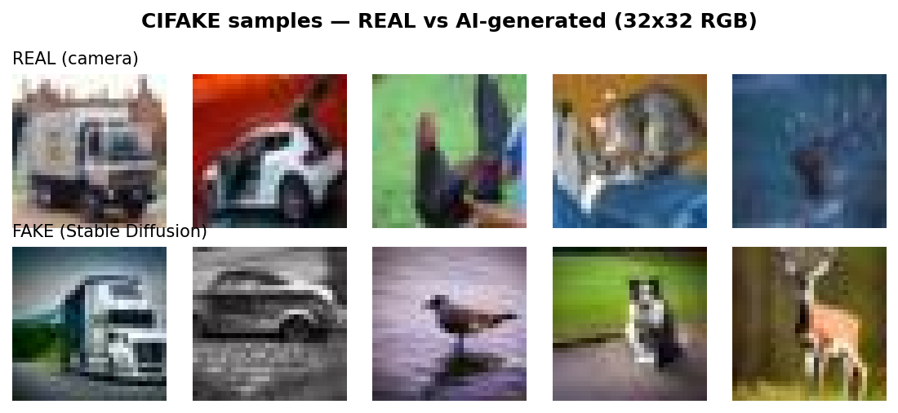{width=92%}

## 3.3 Preprocessing and the FFT channel

**Standard transforms.** Training images are resized to the model's input
resolution, randomly horizontally flipped, given a mild random translation
(±5 %), converted to tensors and channel-normalised. Validation and test images
are only resized and normalised.

**A deliberate restraint.** Heavy Gaussian blur and aggressive down-scaling are
*not* used as augmentations. Robustness studies on CIFAKE show that blur
destroys the very high-frequency structure that distinguishes REAL from FAKE,
collapsing detector accuracy. Avoiding it is a conscious design choice.

**The FFT channel (our contribution).** Diffusion models leave characteristic
artefacts in the Fourier domain — cross/ring patterns in the magnitude spectrum
and an unnatural high-frequency energy profile. Instead of training a separate
spectral model, VeriVision computes the log-magnitude of the 2-D FFT of each
image's luminance channel and appends it as a **fourth input channel**, so a
single network learns jointly from pixel and spectral evidence.

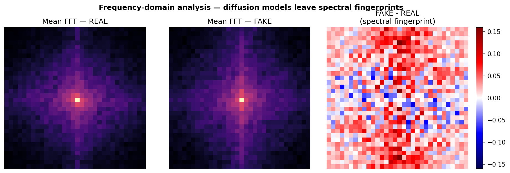{width=98%}

## 3.4 Model architectures

**Custom CNN (from scratch).** Three convolutional blocks (32 → 64 → 128
channels), each a doubled Conv–BatchNorm–ReLU stack followed by 2 × 2
max-pooling, then global average pooling and a two-layer classifier head with
dropout. About 0.2 M trainable parameters. It operates at the native 32 × 32
resolution.

**ResNet-50 (transfer learning).** A torchvision ResNet-50 with ImageNet
pretrained weights; the final fully-connected layer is replaced with a
dropout + two-way classifier. Inputs are up-sampled to 224 × 224 to match the
pretraining distribution, and all layers are fine-tuned.

When the FFT channel is enabled, the first convolution is surgically widened
from three to four input channels — the RGB filter weights are copied verbatim
and the new channel is initialised from their mean, preserving the pretrained
features.

## 3.5 Training methodology

| Setting | Custom CNN | ResNet-50 |
|---|---|---|
| Optimiser | AdamW (lr 1e-3, weight decay 1e-4) | AdamW (lr 1e-3, weight decay 1e-4) |
| LR schedule | Cosine annealing | Cosine annealing |
| Loss | Cross-entropy | Cross-entropy |
| Batch size | 128 | 64 |
| Epoch budget | 10 | 5 |
| Early stopping | Patience 3 on val-loss | Patience 3 on val-loss |

All runs are seeded across `random`, `numpy` and `torch`, with deterministic
cuDNN, so results are reproducible.

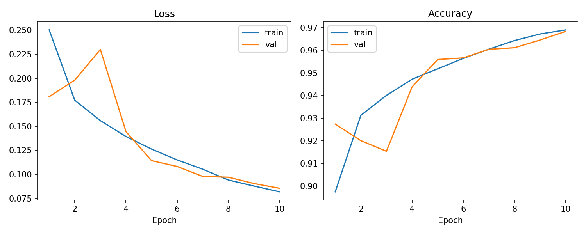{width=88%}

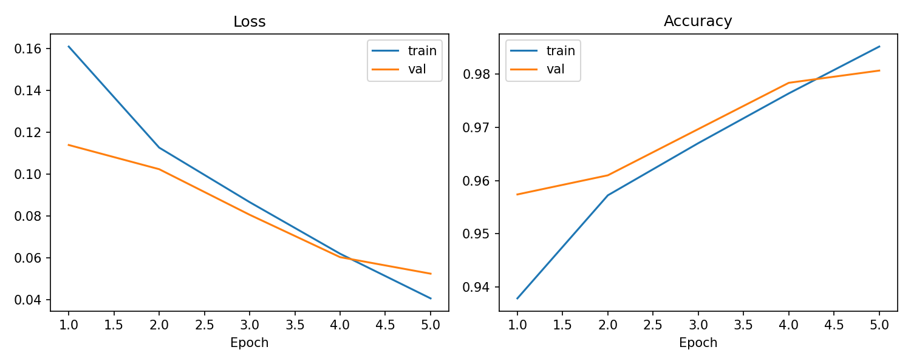{width=88%}

## 3.6 Results and evaluation

Both models were evaluated once, on the untouched 20,000-image CIFAKE test set.

| Metric | Custom CNN | ResNet-50 |
|---|---|---|
| Accuracy | 96.77 % | **98.26 %** |
| Precision | 96.96 % | 98.19 % |
| Recall | 96.57 % | 98.33 % |
| F1-score | 96.76 % | 98.26 % |
| ROC-AUC | 0.9953 | **0.9983** |

The ResNet-50 model is the stronger detector on every metric, as expected from
a deep pretrained backbone. The remarkable result is the **from-scratch CNN**:
with only ~0.2 M parameters it still reaches 96.8 % accuracy, confirming that
the REAL-vs-FAKE signal in CIFAKE is strong and learnable even by a small
network.

{width=58%}

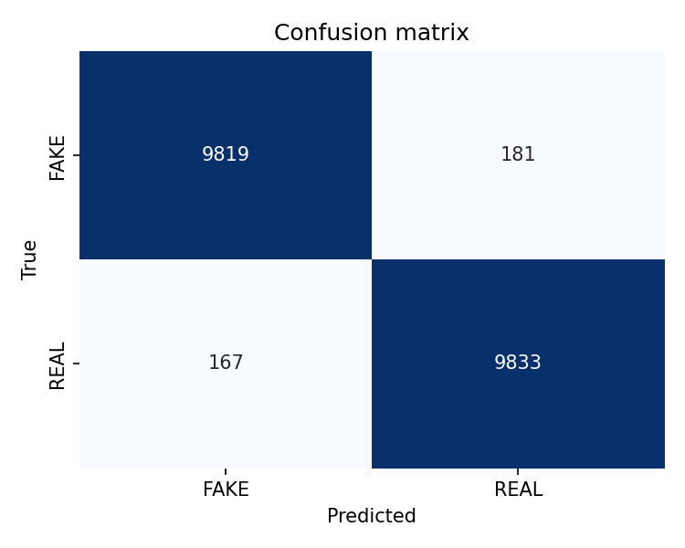{width=58%}

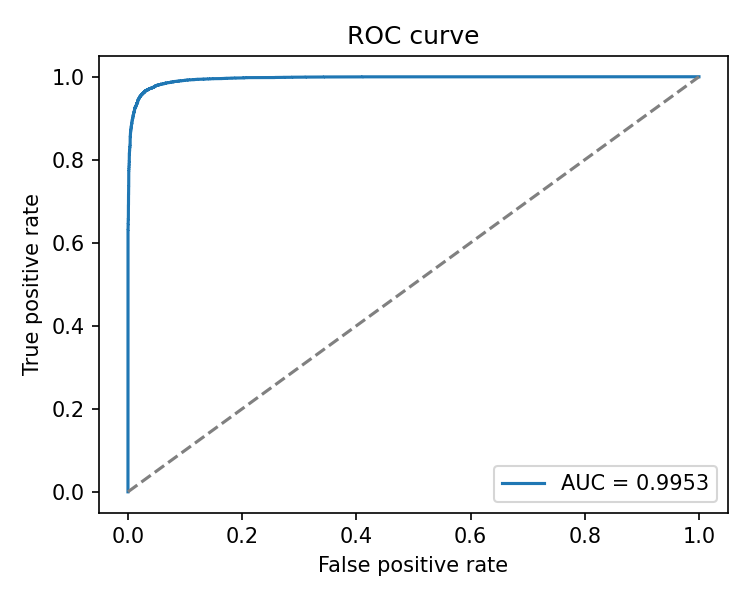{width=58%}

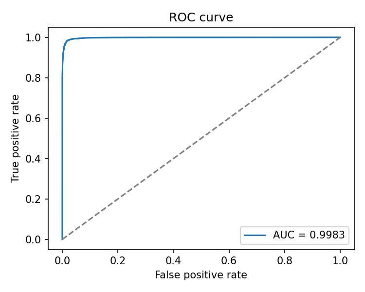{width=58%}

## 3.7 Explainability with Grad-CAM

Every prediction is accompanied by a **Grad-CAM** heatmap. Grad-CAM weighs the
final convolutional feature maps by the gradient of the predicted class,
producing a coarse map of "where the network looked". For the custom CNN the
target layer is the last convolution; for ResNet-50 it is the final bottleneck
block. Heatmaps are upsampled and blended over the input at 40 % opacity.
Consistent with the CIFAKE literature, the maps show detectors keying on
**background texture and high-frequency content** rather than on the foreground
object — exactly the region where generative artefacts concentrate. The
Grad-CAM grid is regenerated by `scripts/demo.py` after training and is also
shown live in the Streamlit demo app.

# 4. Unit 1 — Introduction to Computer Vision

**Syllabus topics:** overview, image formation, geometric vision, the CV
pipeline, applications. **Module:** `src/classical/unit1_image_basics.py`.

## 4.1 Image formation — the pinhole camera

Every real photograph is formed by perspective projection: a 3-D world point
**X** maps to a 2-D pixel **x** through the camera equation
**x ≈ K [R | t] X**, where **K** holds the intrinsic parameters (focal length,
principal point) and **[R | t]** the camera's pose. This is the physical
process that the FAKE half of CIFAKE never undergoes — which is the deepest
reason its image statistics differ.

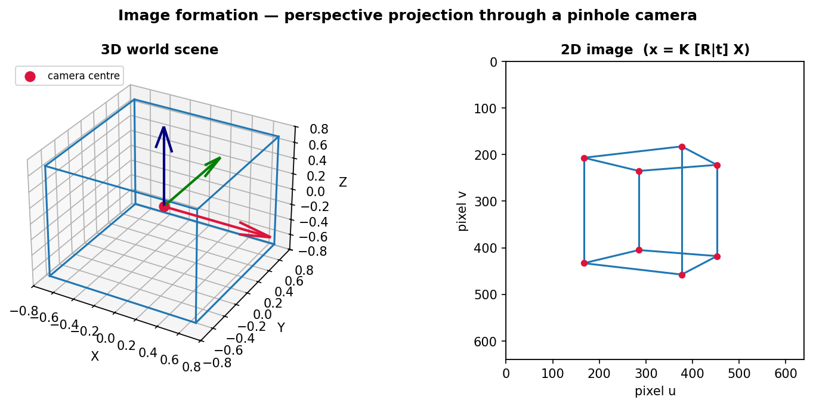{width=92%}

## 4.2 The digital image and colour

A digital image is a sampled grid of intensities. It can be split into colour
channels, reduced to a luminance image, and summarised by an intensity
histogram. Different **colour spaces** expose different cues: RGB is the
display space, HSV separates colour from brightness, and CIELAB is perceptually
uniform.

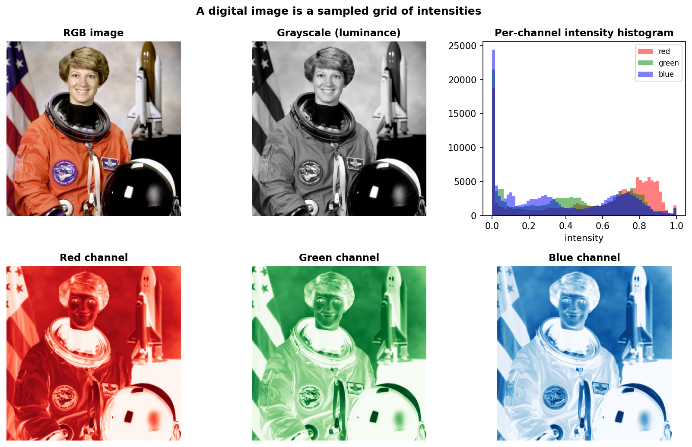{width=92%}

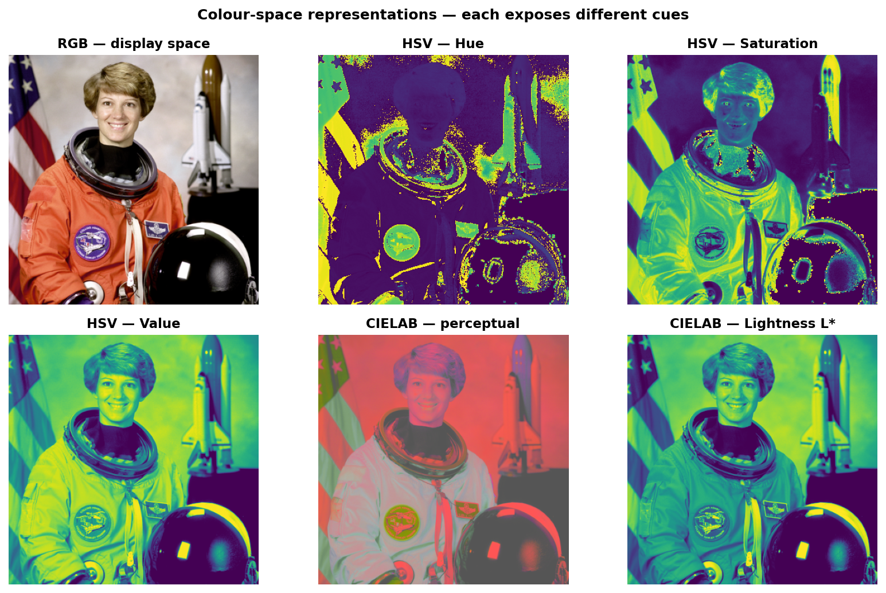{width=92%}

## 4.3 The computer-vision pipeline

Almost every CV system follows the same pipeline: **acquisition →
pre-processing → feature extraction → model/inference → decision**. VeriVision
is a concrete instance of it, and naming the stages makes the rest of this
report easy to place.

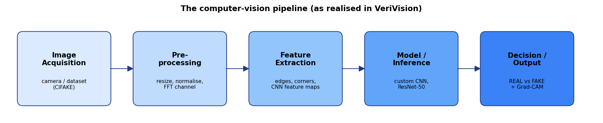{width=98%}

# 5. Unit 2 — Sampling, Multiscale Representations and Features

**Syllabus topics:** image sampling & aliasing, up/down-sampling, multiscale
pyramids, edges, corners, blobs, local features & keypoints, the Hough
transform, RANSAC. **Modules:** `unit2_sampling`, `unit2_features`,
`unit2_hough_ransac`.

## 5.1 Sampling and aliasing

Sampling a signal below the Nyquist rate causes **aliasing**: high frequencies
masquerade as false low frequencies. The cure is to low-pass filter *before*
down-sampling.

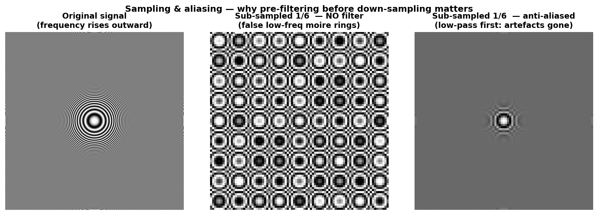{width=96%}

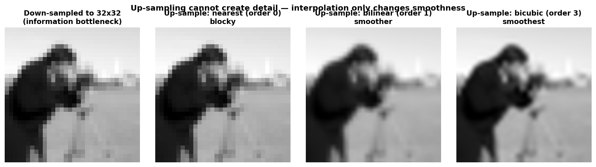{width=98%}

## 5.2 Multiscale image pyramids

Features live at different scales, so images are analysed as **pyramids**: a
Gaussian pyramid is a stack of progressively blurred and shrunk copies; a
Laplacian pyramid stores the band-pass detail lost between levels.

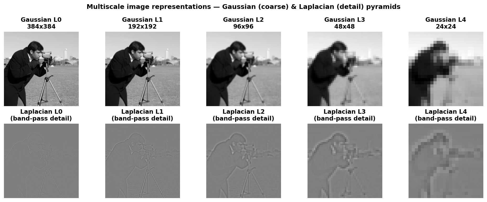{width=98%}

## 5.3 Edges, corners and blobs

**Edges** are intensity discontinuities, found with gradient operators and
refined by the Canny detector. **Corners** are points where intensity changes
in every direction — stable, repeatable interest points (Harris). **Blobs** are
roughly circular regions, detected across scale with the Laplacian-,
Difference- and Determinant-of-Gaussian operators.

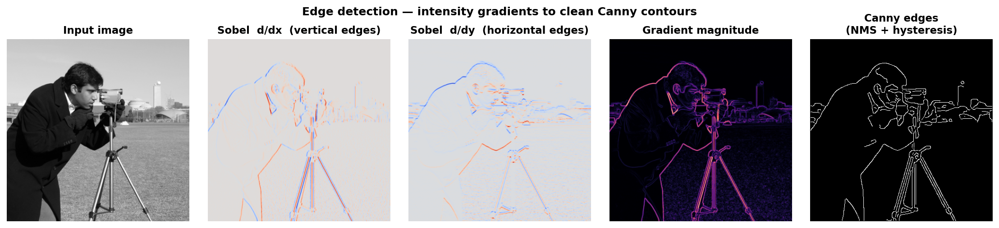{width=98%}

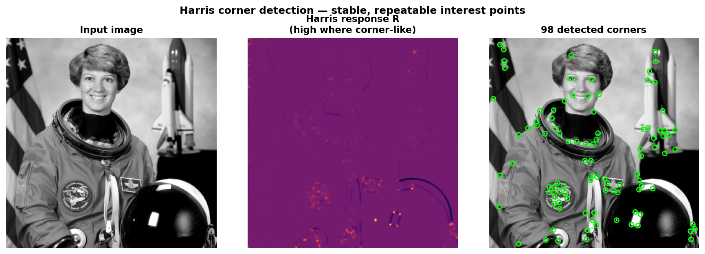{width=92%}

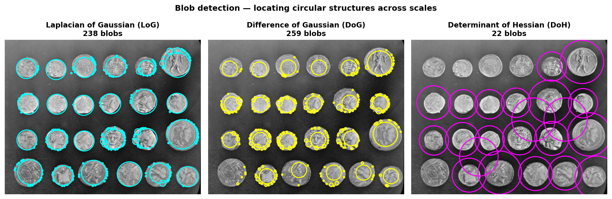{width=96%}

## 5.4 Local features and keypoint matching

A **keypoint** is an interest point plus a descriptor — a compact vector that
characterises its neighbourhood. ORB descriptors can be matched between two
views of a scene, which is the foundation of stitching, tracking and the stereo
geometry of Unit 3.

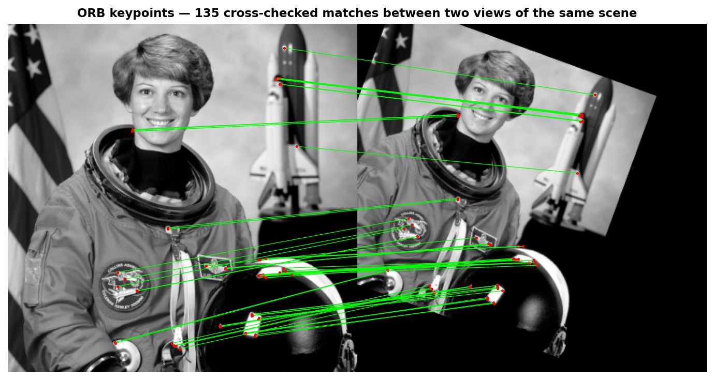{width=92%}

## 5.5 The Hough transform

The **Hough transform** detects parametric shapes by letting every edge pixel
*vote* in a parameter space; shapes appear as peaks in the accumulator. It is
robust to noise and to gaps in the shape.

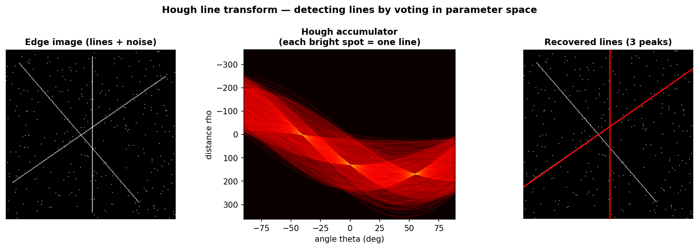{width=96%}

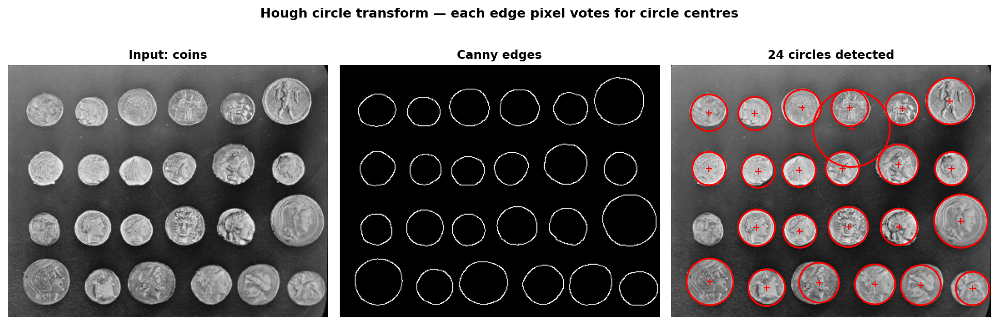{width=96%}

## 5.6 RANSAC — robust model fitting

**RANSAC** (RANdom SAmple Consensus) fits a model when the data are heavily
contaminated with outliers. It repeatedly fits a minimal sample and keeps the
hypothesis with the most inliers — succeeding where ordinary least squares is
dragged off by the outliers.

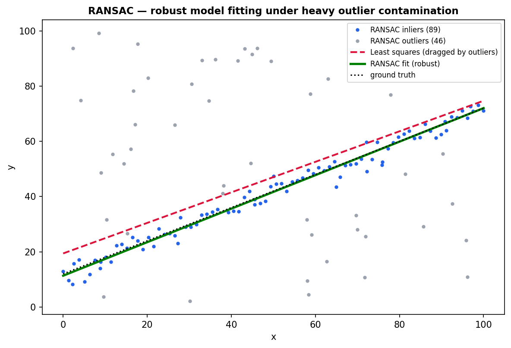{width=70%}

# 6. Unit 3 — Geometric Vision: Transformations and Stereo

**Syllabus topics:** image transformations & warping, stereo vision, depth from
disparity, epipolar geometry, stereo rectification. **Modules:**
`unit3_transforms`, `unit3_stereo`.

## 6.1 The hierarchy of 2-D transformations

Geometric transformations form a hierarchy of increasing freedom: translation
(2 DoF), Euclidean (3), similarity (4), affine (6) and projective/homography
(8). Each preserves a little less structure than the last; the homography is
exactly the map between two images of a planar scene.

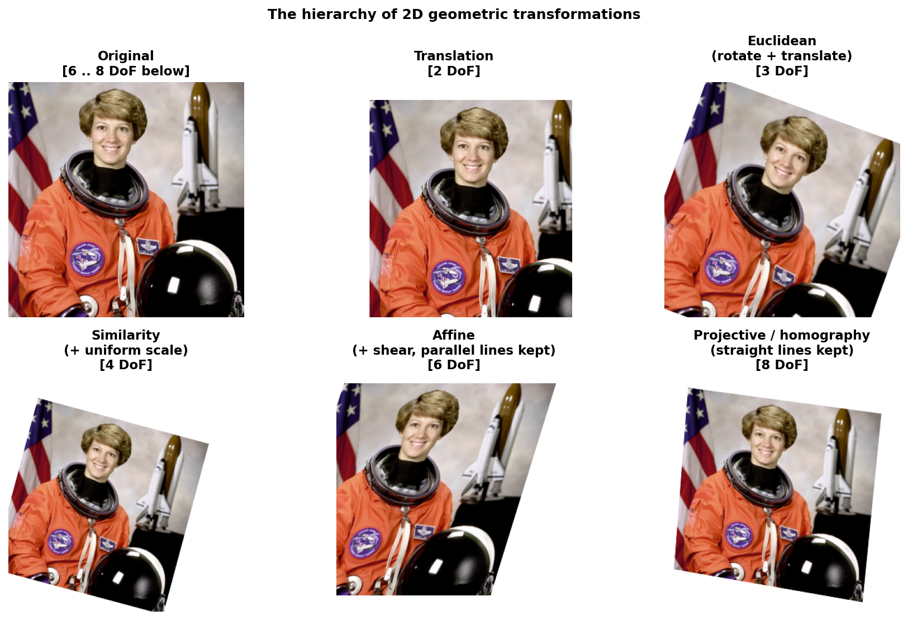{width=85%}

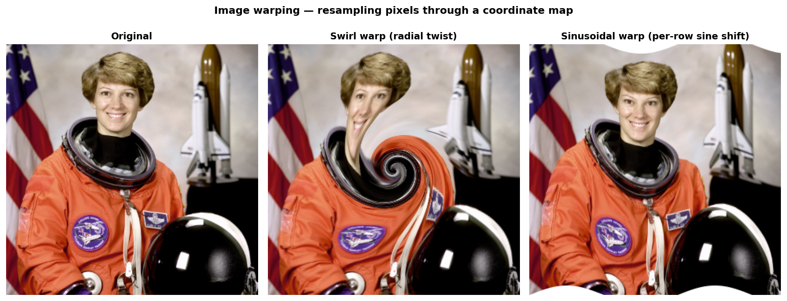{width=96%}

## 6.2 Stereo vision and depth from disparity

Two horizontally displaced cameras see the same scene from slightly different
viewpoints. The horizontal shift of a point between the two images is its
**disparity**, and depth is inversely proportional to it:
**Z = f · B / d**. A block-matching algorithm searches, for every pixel, the
disparity that best aligns a window between the two views.

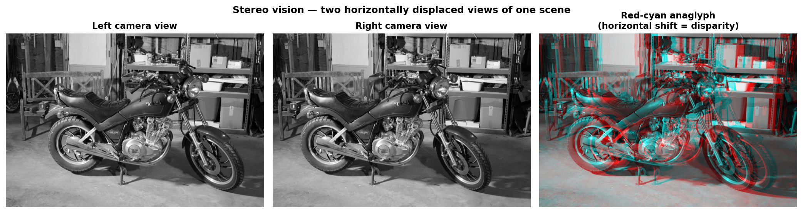{width=98%}

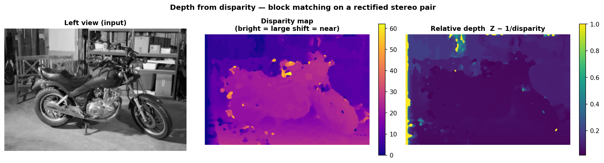{width=98%}

## 6.3 Epipolar geometry

The **fundamental matrix F** captures the geometry between two views: for any
point in one image, its match in the other must lie on a single line — the
**epipolar line**. F is estimated here from ORB matches with RANSAC. Because the
stereo pair is rectified, the epipolar lines come out horizontal, which is what
makes the 1-D disparity search of Section 6.2 valid.

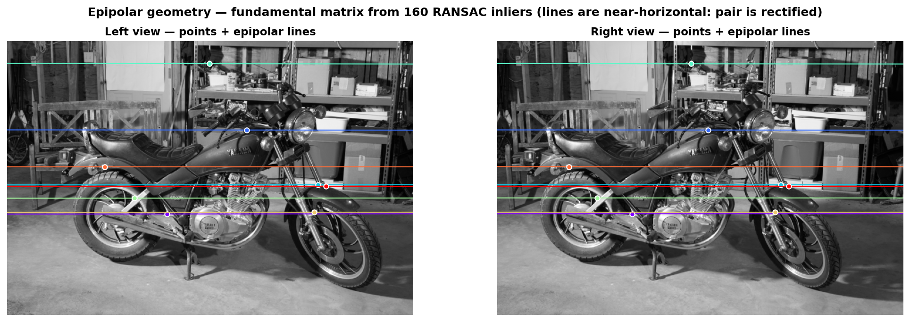{width=98%}

# 7. Unit 4 — Model Fitting and Regularisation

**Syllabus topics:** model fitting, regularisation, kernel regression,
polynomial curve fitting, over- and under-fitting. **Module:**
`unit4_model_fitting`.

These ideas are the statistical foundation of the deep models in Unit 5: a CNN
is simply a very expressive fitted model, and weight decay is ridge
regression.

## 7.1 Polynomial curve fitting and model capacity

Fitting polynomials of increasing degree to the same noisy data shows the core
trade-off: too low a degree **under-fits** (cannot capture the trend), too high
a degree **over-fits** (chases the noise).

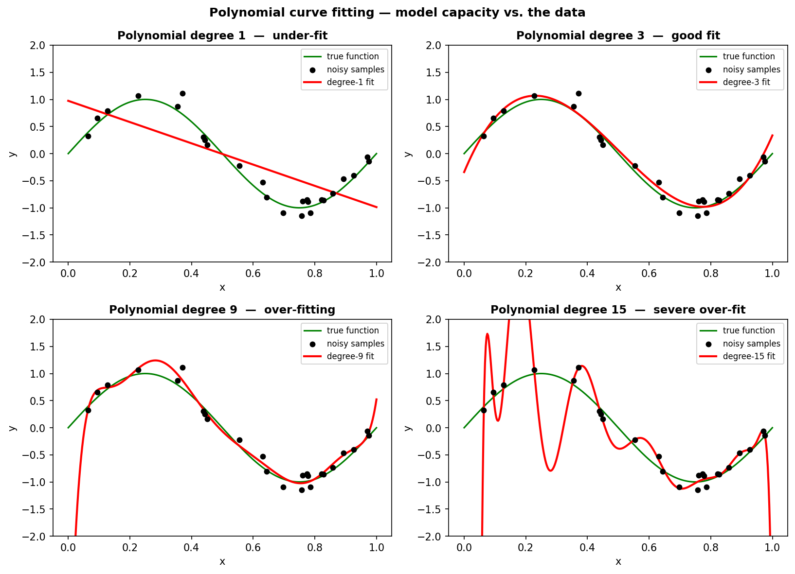{width=82%}

## 7.2 The bias-variance trade-off

Plotting training and test error against model complexity reveals the classic
picture: training error falls monotonically, but test error is **U-shaped**.
The minimum of that U is the best-generalising model.

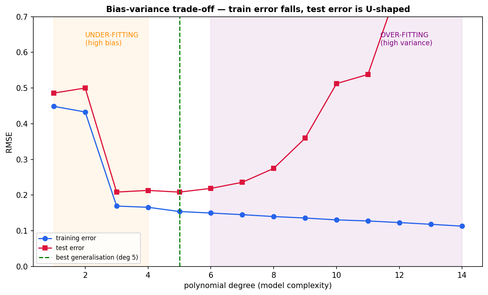{width=78%}

## 7.3 Regularisation

**Regularisation** lets us keep a high-capacity model but penalise complexity.
Ridge (L2) regularisation adds a penalty on the squared weights; as the penalty
grows, an over-capacity degree-15 model is pulled back to a sensible fit.

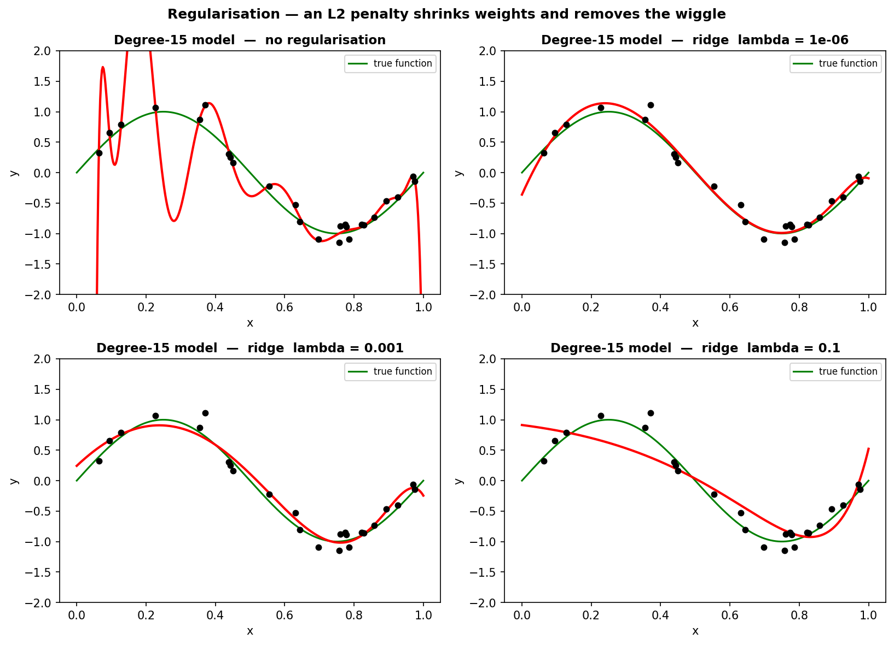{width=82%}

## 7.4 Kernel regression

**Kernel regression** is a non-parametric alternative: the prediction at a
point is a locally weighted average of the data. The kernel bandwidth plays the
role of model capacity — wide kernels under-fit, narrow kernels over-fit.

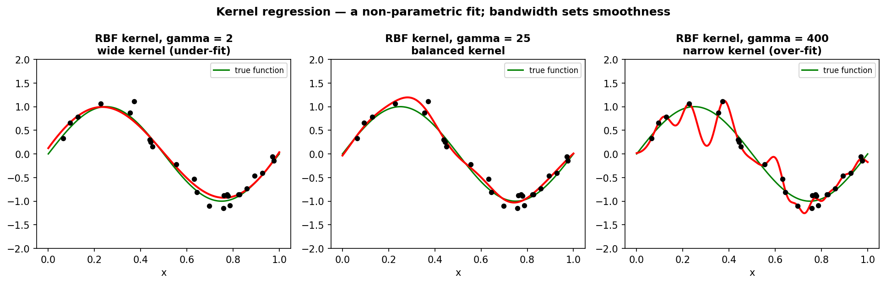{width=96%}

# 8. Unit 5 — Learning in Computer Vision

**Syllabus topics:** supervised learning, neural networks, SGD, optimisers,
back-propagation, convolutional neural networks and architectures.
**Module:** `unit5_learning.py` — and the trained VeriVision CNNs of Section 3.

## 8.1 Convolution — the CNN building block

A convolutional layer slides small **kernels** over the image. Hand-designed
kernels blur, sharpen, emboss or detect edges; a CNN simply *learns* the
kernels that best serve the task instead of having an engineer specify them.

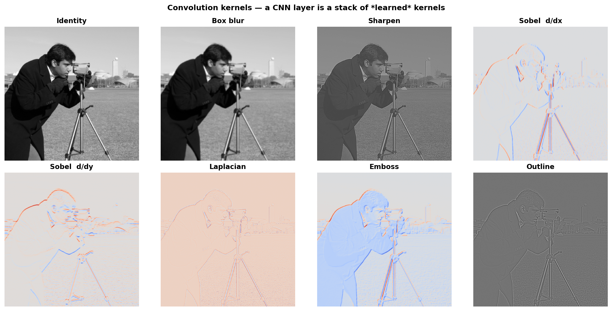{width=98%}

## 8.2 Optimisers and gradient descent

Networks are trained by **gradient descent** on a loss surface. Plain SGD
struggles on ill-conditioned surfaces; **momentum** accelerates it, and
**Adam** adapts a per-parameter step size. VeriVision is trained with AdamW for
exactly this robustness.

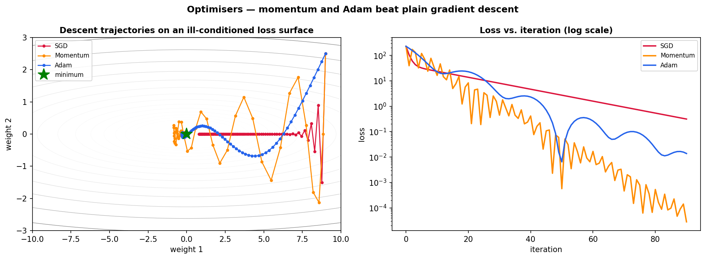{width=98%}

## 8.3 A neural network trained from scratch by back-propagation

To make back-propagation concrete, a two-layer neural network was implemented
in pure NumPy — forward pass, manual gradient computation by the chain rule,
and an SGD update — and trained on a non-linearly-separable dataset.

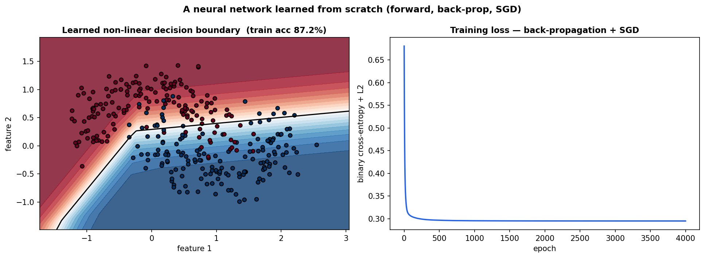{width=98%}

Scaling this principle up — many layers, convolutional weight-sharing, millions
of parameters — gives the custom CNN and ResNet-50 of Section 3. **CNN
architectures** in the syllabus are represented directly by those two trained
models and their results.

# 9. Unit 6 — Motion and Change Detection

**Syllabus topics:** translational alignment & motion estimation, 3-D motion
and its 2-D projection, optical-flow estimation, perception & scene
understanding. **Module:** `unit6_motion.py`.

## 9.1 Optical flow

**Optical flow** is the per-pixel apparent motion between two frames. Estimating
it is the basis of tracking, video stabilisation and action recognition.

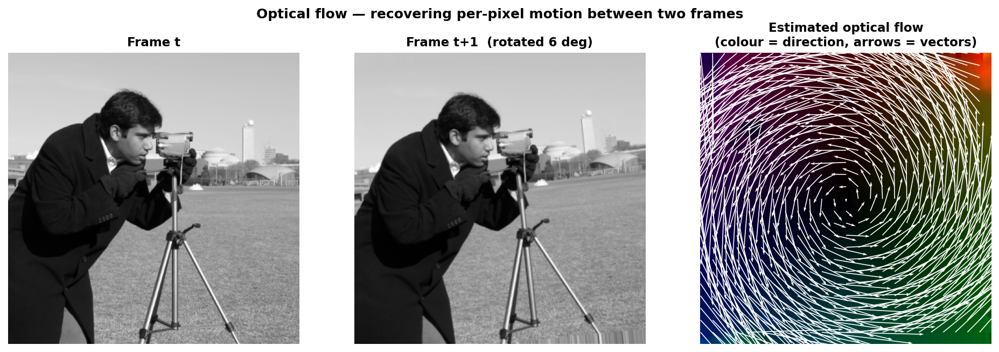{width=96%}

## 9.2 Translational motion estimation

The simplest motion model is a pure translation. **Phase correlation** recovers
an unknown shift between two frames to sub-pixel accuracy — the "translational
alignment" of the syllabus — and is used to align and stabilise frames.

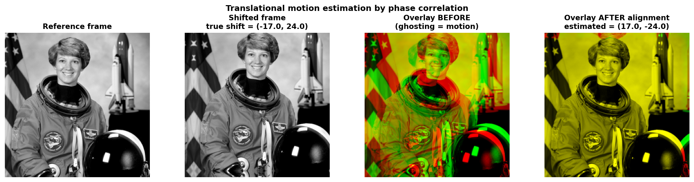{width=98%}

## 9.3 Change detection

When the camera is static, **frame differencing** isolates what moved.
Thresholding the absolute difference and cleaning it morphologically yields a
change mask — the core of video surveillance.

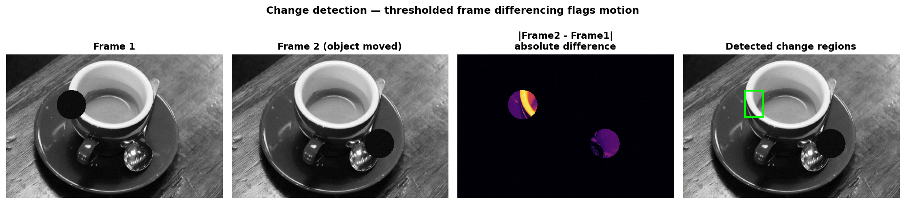{width=98%}

# 10. Unit 7 — Generative Models and Representation Learning

**Syllabus topics:** representation learning, perceptual grouping, generative
models, conditional generative models. **Module:** `unit7_representation.py` —
and VeriVision itself, which *detects* conditional generative models.

## 10.1 Representation learning with PCA

**Representation learning** seeks compact features that expose the structure of
data. PCA is its linear archetype: it learns "eigen-images" — directions of
maximum variance — and an image can be reconstructed from just a few
coefficients. PCA is the linear cousin of the autoencoder.

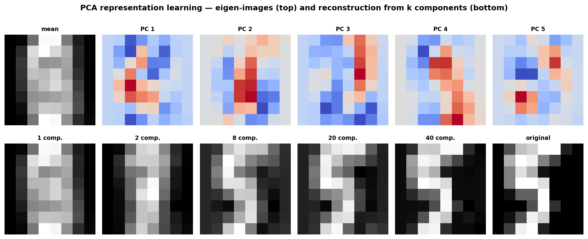{width=98%}

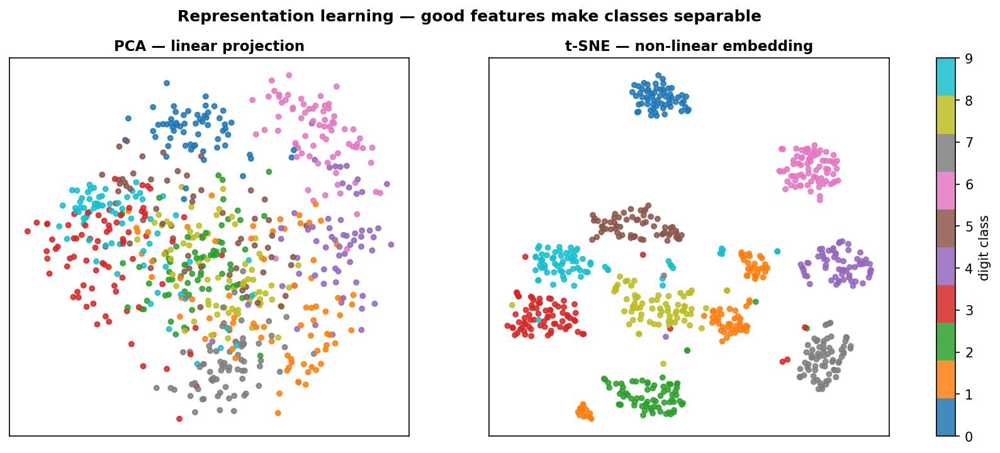{width=96%}

## 10.2 Perceptual grouping — segmentation

**Perceptual grouping** partitions an image into coherent regions. Superpixel
and graph-based segmentation algorithms group pixels by colour and proximity —
a compact mid-level representation for downstream recognition.

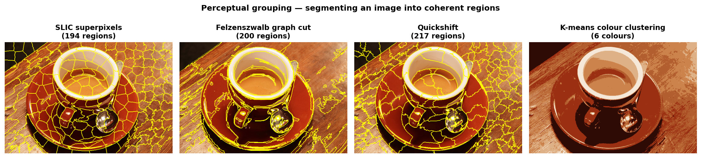{width=98%}

## 10.3 Generative models

A **generative model** learns the distribution of data so it can synthesise new
samples. A simple linear generative model fits PCA, treats the component scores
as a Gaussian latent code, samples fresh codes and decodes them. This is the
same *encode → sample latent → decode* recipe behind VAEs; modern diffusion
models replace the linear decoder with a deep iterative denoiser, and
**conditional** generative models add a text prompt.

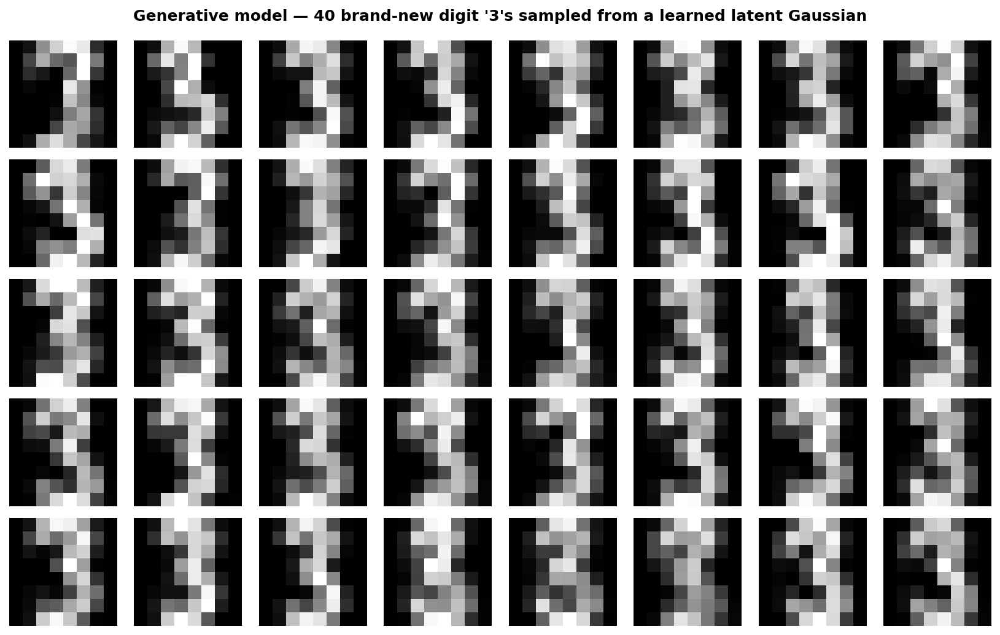{width=82%}

## 10.4 The connection back to VeriVision

This unit closes the loop. The FAKE images that VeriVision is trained to detect
are the output of a **conditional generative model** — Stable Diffusion
prompted with a class name. Understanding how generative models work (this
unit) is what makes it possible to *detect* them (Section 3). VeriVision is, in
effect, the adversary of Unit 7's generators.

# 11. Course Learning Outcome Mapping

The project was built to evidence the AIC341 lab learning outcomes and to touch
every unit of the syllabus.

| Unit | Syllabus area | Project component | Report section |
|---|---|---|---|
| 1 | Introduction & image formation | `unit1_image_basics` | §4 |
| 2 | Sampling, features, Hough, RANSAC | `unit2_sampling/features/hough_ransac` | §5 |
| 3 | Transformations, stereo, epipolar geometry | `unit3_transforms`, `unit3_stereo` | §6 |
| 4 | Model fitting & regularisation | `unit4_model_fitting` | §7 |
| 5 | Learning, CNNs, optimisation | `unit5_learning` + VeriVision CNNs | §3, §8 |
| 6 | Motion & change detection | `unit6_motion` | §9 |
| 7 | Generative models & representation learning | `unit7_representation` + VeriVision | §3, §10 |

| Lab CLO | Statement | Evidence |
|---|---|---|
| **CLO-5** | Implement core CV algorithms using appropriate tools and libraries | Ten classical-CV modules in `src/classical/` plus the full VeriVision training and evaluation pipeline — all runnable, all producing real figures. |
| **CLO-6** | Develop a CV application in a team environment | VeriVision built end to end (data → preprocessing → models → evaluation → Streamlit demo → report) by a three-member team with divided responsibilities (see Appendix). |

# 12. How to Run the Project

All commands are run from the project root.

**Environment**

```bash
python -m venv .venv && source .venv/bin/activate
pip install -r requirements.txt
```

**Classical-CV toolkit (Units 1–7) — no GPU or dataset needed**

```bash
python -m scripts.run_classical --unit all      # writes reports/figures/classical/
python -m scripts.run_classical --unit 3        # a single unit
```

**VeriVision detector**

```bash
# Data figures (works from the bundled sample images)
python -m scripts.verivision_figures

# Train / evaluate / predict (needs the CIFAKE dataset — see data/README.md)
python -m scripts.train     --model resnet50 --epochs 5
python -m scripts.evaluate  --checkpoint models_ckpt/resnet50.pt
python -m scripts.predict   --checkpoint models_ckpt/resnet50.pt --image my.jpg --gradcam

# Interactive web demo
streamlit run app/streamlit_app.py
```

**Rebuild this report**

```bash
python -m scripts.build_report          # produces the .docx and .pdf
```

# 13. Conclusion, Limitations and Future Work

## 13.1 Conclusion

VeriVision delivers a working, interpretable AI-image detector: a from-scratch
CNN at **96.8 %** accuracy and a ResNet-50 model at **98.3 %** accuracy with a
**0.998** ROC-AUC on the CIFAKE test set, with an FFT-channel preprocessing
contribution and Grad-CAM explanations throughout. Around that detector, a
ten-module classical-CV toolkit demonstrates **every remaining unit** of the
AIC341 syllabus with real, reproducible result figures. The project therefore
stands as a coherent whole-course portfolio rather than a single-topic
exercise.

## 13.2 Limitations

- **Resolution.** CIFAKE is 32 × 32; real-world generated images are far
  larger, so the detector may not transfer directly.
- **Generator coverage.** The FAKE images come only from Stable Diffusion v1.4;
  generalisation to Midjourney, DALL·E 3 or newer models is untested.
- **Classical demos** use standard sample images for clarity and speed; they
  illustrate the algorithms rather than benchmark them.

## 13.3 Future work

- Move to a high-resolution, multi-generator dataset and add test-time
  robustness evaluation (compression, blur, re-sampling).
- Fuse the classical and deep pipelines — for example, feed Fourier and
  wavelet statistics alongside CNN features.
- Extend the detector to video using the optical-flow and change-detection
  tools of Unit 6.

# 14. References

1. Bird, J. J., & Lotfi, A. (2024). *CIFAKE: Image Classification and
   Explainable Identification of AI-Generated Synthetic Images.* IEEE Access.
2. Selvaraju, R. R., et al. (2017). *Grad-CAM: Visual Explanations from Deep
   Networks via Gradient-based Localization.* ICCV.
3. He, K., Zhang, X., Ren, S., & Sun, J. (2016). *Deep Residual Learning for
   Image Recognition.* CVPR.
4. Torralba, A., Isola, P., & Freeman, W. T. (2024). *Foundations of Computer
   Vision.* MIT Press.
5. Szeliski, R. (2022). *Computer Vision: Algorithms and Applications*
   (2nd ed.). Springer.
6. Verdhan, V. (2021). *Computer Vision Using Deep Learning.* Apress.
7. Lowe, D. G. (2004). *Distinctive Image Features from Scale-Invariant
   Keypoints.* IJCV.
8. Fischler, M. A., & Bolles, R. C. (1981). *Random Sample Consensus.*
   Communications of the ACM.
9. van der Walt, S., et al. (2014). *scikit-image: Image Processing in Python.*
   PeerJ.

# 15. Appendix — Team and Contributions

| Member | Registration | Primary responsibility |
|---|---|---|
| Shahzaib Haider Rizvi | FA23-BAI-050 | Data pipeline, preprocessing, the FFT-channel contribution |
| Aymen Ali Seemab | FA23-BAI-011 | Model architectures, training loop, classical-CV toolkit |
| Nimra Tahseen Yousaf | FA23-BAI-043 | Evaluation, Grad-CAM, Streamlit demo, report |

*Responsibilities were shared collaboratively; the table records each member's
primary focus area.*

---

*VeriVision — submitted for AIC341 Introduction to Computer Vision, COMSATS
University Islamabad, May 2026.*
